# Diagramme UML
[Lien Diagramme Uml](backend/Diagramme.jpeg)

# Définition des Endpoints:<br>
on a décidé de définir 6 Endpoints prioritaires

## getAllCommandesNonLivres: <br>
    Récupérer toutes les commandes avec le status NON_LIVREE ou ANNULLEE, 
    l'algorithme de création des tournées prendra ces commandes pour ensuite 
    créer des tournées avec

## getNombreDeCommandesNonLivrés
    Récupérer le nombre de commandes avec le status NON_LIVREE ou ANNULEE

## getNombreEquipes
    Récupérer le nombre des équipes disponibles

## getNombreHeuresMax
    Récupérer le nombre d'heures max définie

## createTournee
    suite au calcul des tournées via les algorithmes et validation du planificateur, 
    les tournées validées doivent être stockées dans la base de données via un Post 

## getAllTournéesByDate
    Récupérer toutes les tournées d'une date spécifique 

# Tester les Endopints
    pour tester les endpoints , un fichier data.sql a été généré qui contient des script SQL permettant d'enrichir la base 
    de données avec des entités valides
```sql
-- =============================================
-- ADRESSES
-- =============================================
INSERT INTO adresse_entity (id, numero_rue, rue, ville, code_postal, pays, latitude, longitude)
VALUES (1, 10, 'Rue de la Paix', 'Paris', 75001, 'France', 48.8698, 2.3309);

INSERT INTO adresse_entity (id, numero_rue, rue, ville, code_postal, pays, latitude, longitude)
VALUES (2, 25, 'Avenue des Champs-Elysees', 'Paris', 75008, 'France', 48.8698, 2.3077);

INSERT INTO adresse_entity (id, numero_rue, rue, ville, code_postal, pays, latitude, longitude)
VALUES (3, 5, 'Rue Victor Hugo', 'Lyon', 69001, 'France', 45.7640, 4.8357);

INSERT INTO adresse_entity (id, numero_rue, rue, ville, code_postal, pays, latitude, longitude)
VALUES (4, 42, 'Boulevard Gambetta', 'Grenoble', 38000, 'France', 45.1885, 5.7245);

INSERT INTO adresse_entity (id, numero_rue, rue, ville, code_postal, pays, latitude, longitude)
VALUES (5, 8, 'Rue des Lilas', 'Bordeaux', 33000, 'France', 44.8378, 0.5792);

-- =============================================
-- EQUIPES
-- =============================================
INSERT INTO equipe_entity (numero_equipe, nb_heures_max)
VALUES (1, 8.5);

INSERT INTO equipe_entity (numero_equipe, nb_heures_max)
VALUES (2, 7.0);

INSERT INTO equipe_entity (numero_equipe, nb_heures_max)
VALUES (3, 9.0);

-- =============================================
-- VEHICULES
-- =============================================
INSERT INTO vehicule_entity (matricule, capacite_poids_max, capacite_volume_max, equipe_numero_equipe)
VALUES (101, 1500.0, 12.0, 1);

INSERT INTO vehicule_entity (matricule, capacite_poids_max, capacite_volume_max, equipe_numero_equipe)
VALUES (102, 2000.0, 18.0, 2);

INSERT INTO vehicule_entity (matricule, capacite_poids_max, capacite_volume_max, equipe_numero_equipe)
VALUES (103, 1200.0, 10.0, 3);

-- =============================================
-- LIVREURS
-- =============================================
INSERT INTO livreur_entity (id_livreur, nom, prenom, permis, telephone, equipe_numero_equipe, equipe2_numero_equipe)
VALUES (1, 'Dupont', 'Jean', true, '0601010101', 1, NULL);

INSERT INTO livreur_entity (id_livreur, nom, prenom, permis, telephone, equipe_numero_equipe, equipe2_numero_equipe)
VALUES (2, 'Martin', 'Pierre', true, '0602020202', 2, NULL);

INSERT INTO livreur_entity (id_livreur, nom, prenom, permis, telephone, equipe_numero_equipe, equipe2_numero_equipe)
VALUES (3, 'Bernard', 'Marie', true, '0603030303', 3, NULL);

INSERT INTO livreur_entity (id_livreur, nom, prenom, permis, telephone, equipe_numero_equipe, equipe2_numero_equipe)
VALUES (4, 'Petit', 'Lucas', false, '0604040404', NULL, 1);

INSERT INTO livreur_entity (id_livreur, nom, prenom, permis, telephone, equipe_numero_equipe, equipe2_numero_equipe)
VALUES (5, 'Moreau', 'Emma', false, '0605050505', NULL, 1);

INSERT INTO livreur_entity (id_livreur, nom, prenom, permis, telephone, equipe_numero_equipe, equipe2_numero_equipe)
VALUES (6, 'Simon', 'Noah', false, '0606060606', NULL, 2);

INSERT INTO livreur_entity (id_livreur, nom, prenom, permis, telephone, equipe_numero_equipe, equipe2_numero_equipe)
VALUES (7, 'Laurent', 'Lea', false, '0607070707', NULL, 3);

-- =============================================
-- TOURNEES : a creer via l API POST /api/tournees/tournee
-- =============================================

-- =============================================
-- PRODUITS
-- =============================================
INSERT INTO produit_entity (reference, nom, commande_id)
VALUES ('PROD-001', 'Television 55 pouces', NULL);

INSERT INTO produit_entity (reference, nom, commande_id)
VALUES ('PROD-002', 'Refrigerateur', NULL);

INSERT INTO produit_entity (reference, nom, commande_id)
VALUES ('PROD-003', 'Lave-linge', NULL);

INSERT INTO produit_entity (reference, nom, commande_id)
VALUES ('PROD-004', 'Micro-ondes', NULL);

INSERT INTO produit_entity (reference, nom, commande_id)
VALUES ('PROD-005', 'Canape 3 places', NULL);

-- =============================================
-- COMMANDES (statut en String car @Enumerated(EnumType.STRING))
-- =============================================
INSERT INTO commande_entity (numero_commande, date_limite, statut, poids, volume, adresse_id, tournee_id_tournee)
VALUES ('CMD-001', '2026-03-15', 'LIVREE', 25.5, 0.8, 1, NULL);

INSERT INTO commande_entity (numero_commande, date_limite, statut, poids, volume, adresse_id, tournee_id_tournee)
VALUES ('CMD-002', '2026-03-15', 'LIVREE', 60.0, 1.2, 2, NULL);

INSERT INTO commande_entity (numero_commande, date_limite, statut, poids, volume, adresse_id, tournee_id_tournee)
VALUES ('CMD-003', '2026-03-13', 'EN_COURS', 45.0, 0.9, 3, NULL);

INSERT INTO commande_entity (numero_commande, date_limite, statut, poids, volume, adresse_id, tournee_id_tournee)
VALUES ('CMD-004', '2026-03-20', 'PLANIFIEE', 30.0, 0.6, 4, NULL);

INSERT INTO commande_entity (numero_commande, date_limite, statut, poids, volume, adresse_id, tournee_id_tournee)
VALUES ('CMD-005', '2026-03-18', 'NON_PLANIFIEE', 15.0, 0.3, 5, NULL);

INSERT INTO commande_entity (numero_commande, date_limite, statut, poids, volume, adresse_id, tournee_id_tournee)
VALUES ('CMD-006', '2026-03-19', 'NON_PLANIFIEE', 20.0, 0.5, 1, NULL);

-- =============================================
-- TOURNEE <-> COMMANDES : sera rempli via l API
-- =============================================

-- =============================================
-- EQUIPE <-> MANUTENTIONNAIRES
-- =============================================
INSERT INTO equipe_entity_manutentionnaires (equipe_entity_numero_equipe, manutentionnaires_id_livreur)
VALUES (1, 4);

INSERT INTO equipe_entity_manutentionnaires (equipe_entity_numero_equipe, manutentionnaires_id_livreur)
VALUES (1, 5);

INSERT INTO equipe_entity_manutentionnaires (equipe_entity_numero_equipe, manutentionnaires_id_livreur)
VALUES (2, 6);

INSERT INTO equipe_entity_manutentionnaires (equipe_entity_numero_equipe, manutentionnaires_id_livreur)
VALUES (3, 7);
```

suite à l'injection du SQL , on démarre notre server sur swagger<br>
**en local**<br>
[lien Swagger ](http:://localhost:8080/swagger-ui/index.html)
<br>
**sur une machine virtuelle**<br>
*http:://IP_MACHINE-VIRTUELLE:8080/swagger-ui/index.html*

**Rendu Swagger**
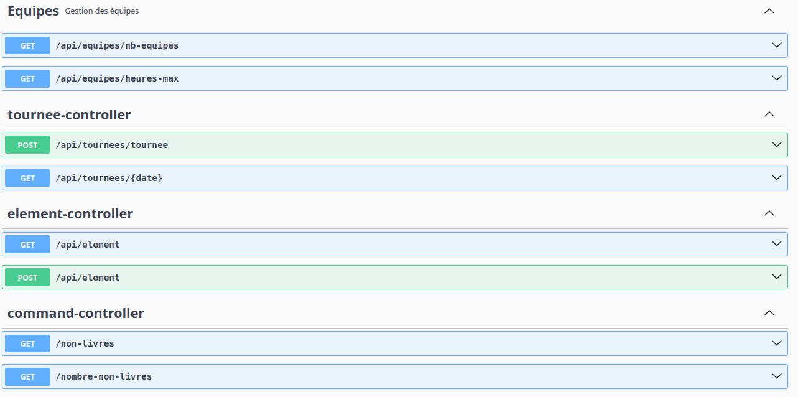

# TestEndointsEquipe
## getNombreEquipes
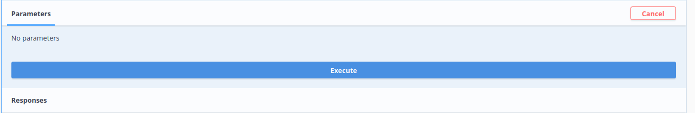
## résultat:
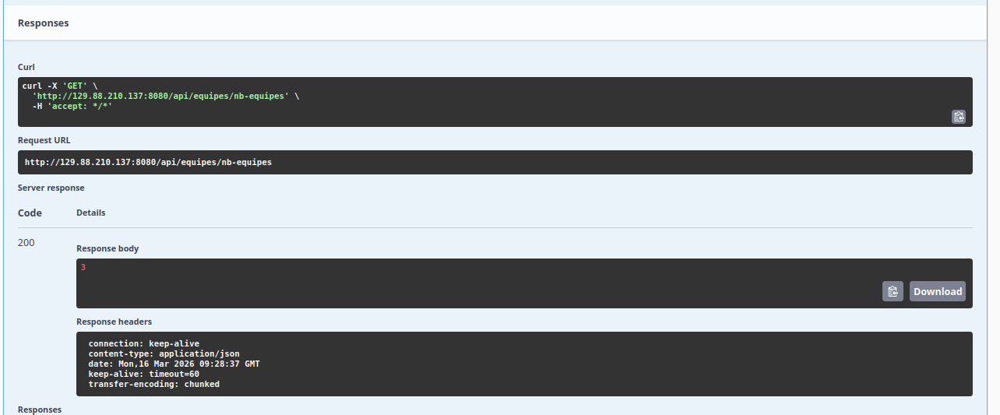
## getHeuresMax
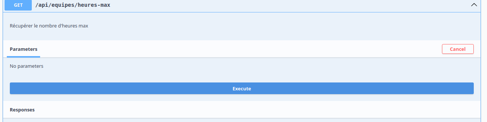
## résultat
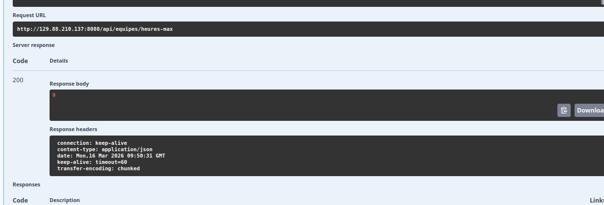 <br>

# TestEndpointsCommandes
## getToutesLesCommandesNonLivrées
cette endopint nous permet de récupérer toutes les commandes avec le status NON_PLANIFIEE ou ANNULEE,
c'est possible grâce à la requête Défine dans **CommandeRepository**
```java
    @Query("SELECT c FROM CommandeEntity c WHERE c.statut = 'NON_PLANIFIEE' OR c.statut = 'ANNULEE'")
    Set<CommandeEntity> getNonPlanifieesOuAnnulees();
```
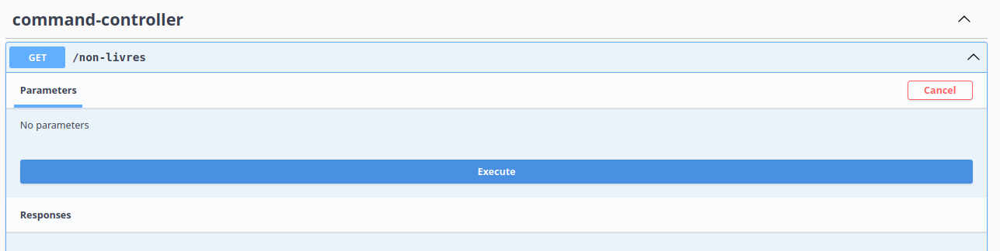
## résultat attendue: 
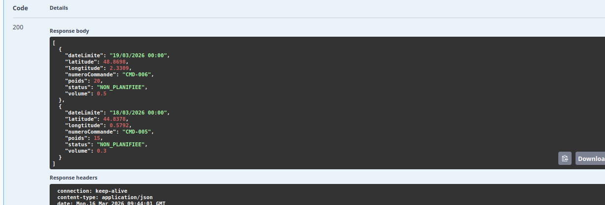
## getNombreCommandesNonLivrées
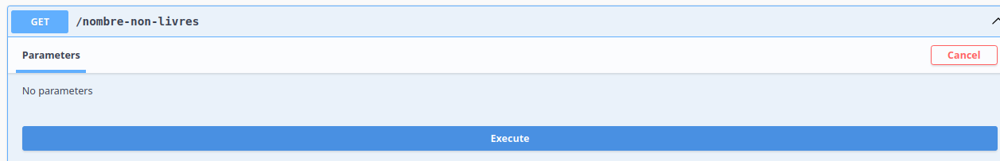
## résultat:
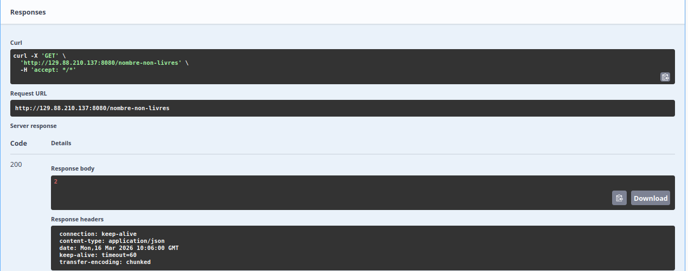

# TestEndopintsTournee
## PostTournee:Création Tournée
pour la création d'une tournée le client devra un JSON sous le format de **TourneeRequestDTO** 
```java
package fr.uga.miage.l3.responses;


import io.swagger.v3.oas.annotations.media.Schema;
import lombok.Data;

import java.sql.Timestamp;
import java.util.Date;


@Data
@Schema(description = "DTO représentant une tournée de livraison")
public class TourneeResponseDTO
{
@Schema(description = "id de la tournée ")
private int idTournee;
@Schema(description = "Temps total estimé de la tournée", example = "125.5")
private double tempsTotal;
@Schema(description = "Date de la tournée", example = "2025-04-15")
private Date dateTournee;
@Schema(description = "Heure de départ de la tournée", example = "08:30:00")
private Timestamp heureDepart;
@Schema(description = "Distance totale parcourue pendant la tournée en kilomètres", example = "42.7")
private double distanceTotale;

@Schema(description = "Numéro de l'équipe responsable de la tournée", example = "3")
private int numeroEquipe;
}
```
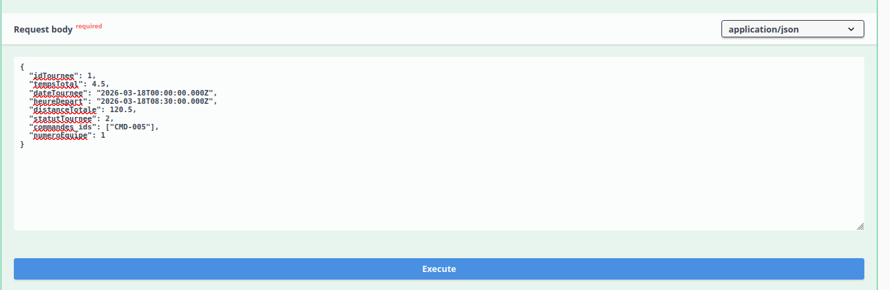

## Résultat : 
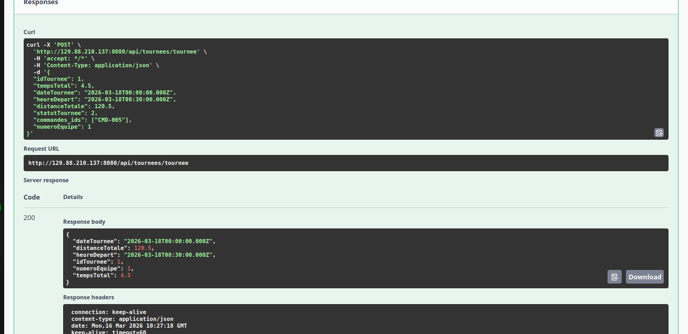


    
