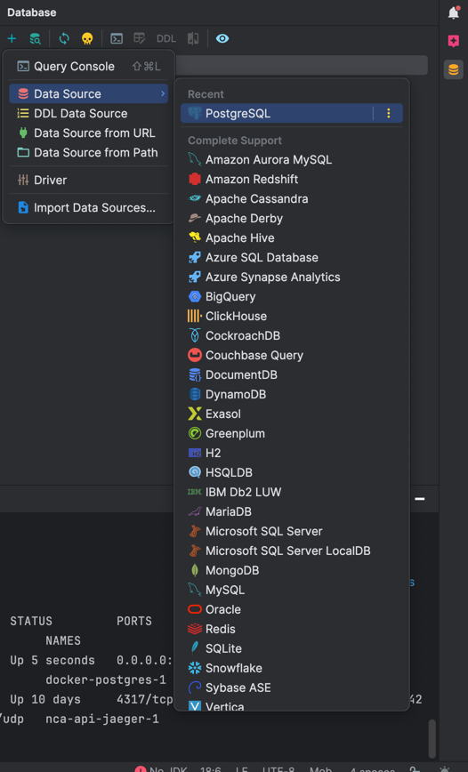
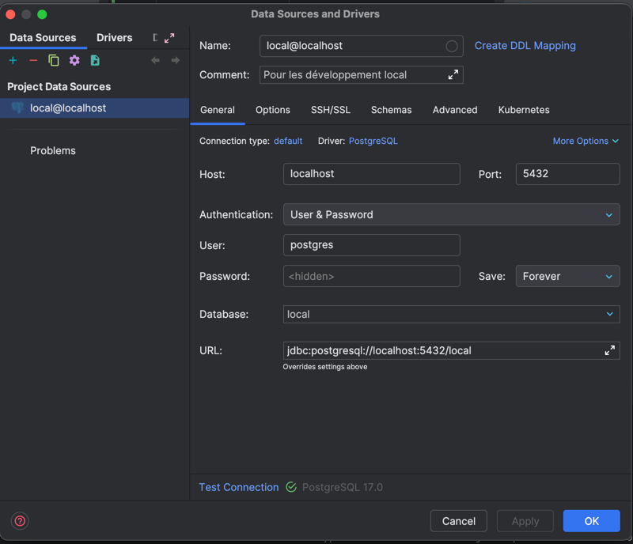

# Projet Intégrateur 2025-2026

## Frontend

* Vous trouverez la doc d'installation du frontend dans le fichier [`README-INSTALLATION`](client/README-INSTALLATION.md)

## Backend

### Base de donnée local

* Vous pouvez créer une base de données local via le fichier [docker/docker-compose-local.yml](./docker/docker-compose-local.yml)

#### Prérequis

1. Avoir installé sur votre machine
    * pour [windows](https://docs.docker.com/desktop/setup/install/windows-install/) 
    * pour les [autres](https://docs.docker.com/engine/install/)
2. Avoir [docker-compose](https://docs.docker.com/compose/install/)

Sur les VM, tout cela est déjà installé normalement.

#### Commande de démarrage
```shell
sudo docker compose -f docker/docker-compose-local.yml up --detach
```

#### Commande d'arrêt
```shell
docker compose -f docker/docker-compose-local.yml down
```

#### Voir les données

* Pour voir les données de la base de données, ajoutez une data-source dans inttelij de cette manière
    1. Demande de création d'une data-source
        
    2. configuration de la data source  
        
        avec comme mot de passe`postgres`


### Variable d'environnements

* Les variables d'environnement à mettre dans le `.env`

```dotenv
DB_USERNAME=<username>
DB_PASSWORD=<password>
DB_URL=jdbc:postgres/<server>:<port>/<database>
DB_JPA_DDL_AUTO=<create-drop | create | update | validate | none>
```
Référez-vous au fichier `docker/docker-compose-local.yml` pour connaitre a configuration locale.

### Compiler le serveur

```shell
cd backend
mvn clean install
```

### Démarrer spring 
```shell
cd backend
mvn spring-boot:run -f server
```
