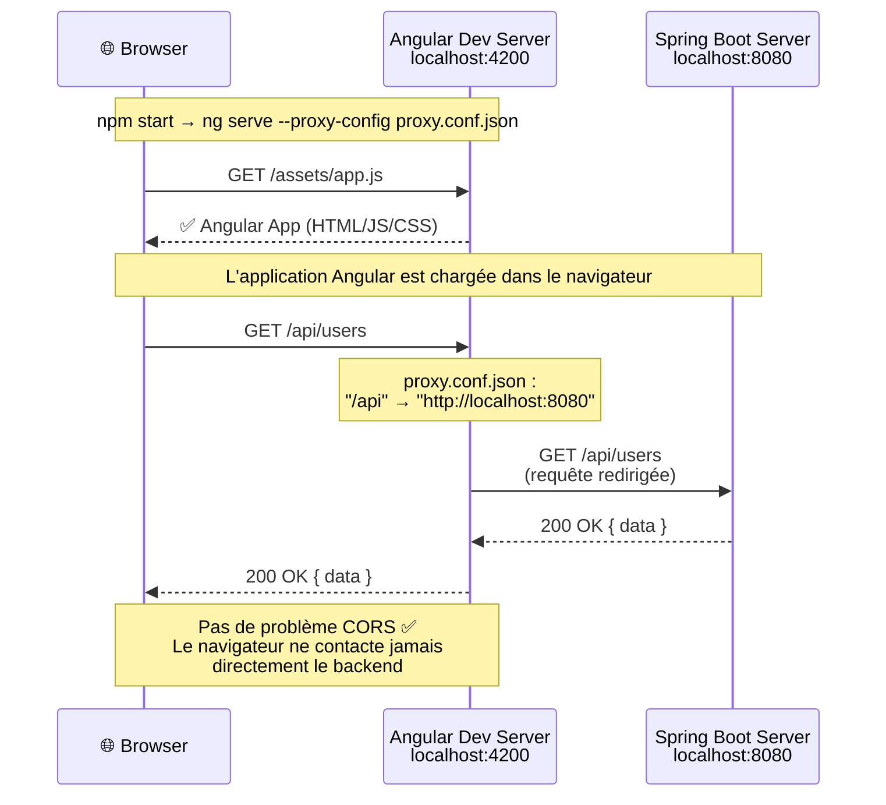
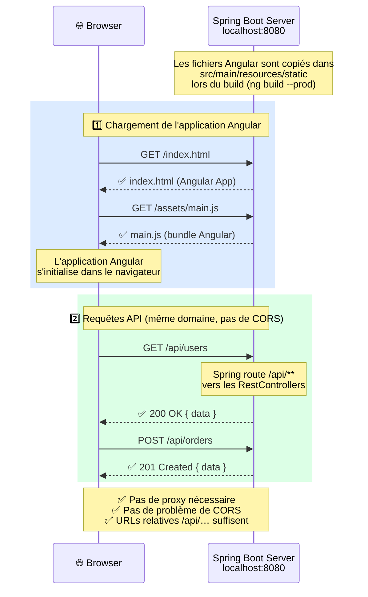

# Client Angular

Il faudra placer votre client Angular dans ce dossier. Le plus simple sera de ne copîer que les fichiers de votre projet Angular sans le répertoire `.git` pour éviter les conflits avec le projet global.

Votre client devra comminiquer avec le backend via les API REST que vous aurez définies. Assurez-vous de configurer correctement les URL de vos services Angular pour qu'ils pointent vers le backend : **N'utiisez PAS d'URL avec un nom de domaine ou une adresse IP, utilisez plutôt des URL relatives**. Par exemple, si votre backend est accessible à l'adresse `http://localhost:8080`, vos services Angular devraient utiliser des URL comme `/api/endpoint` au lieu de `http://localhost:8080/api/endpoint`. Cela permettra à votre client de fonctionner correctement dans différents environnements (local, staging, production) sans nécessiter de modifications supplémentaires.

## Communication avec le backend en mode développement

En mode développement (quand vous exécutez votre client Angular avec `npm start`), vous pouvez configurer un proxy pour rediriger les requêtes API vers le backend. Cela permet d'éviter les problèmes de CORS et de simplifier la configuration des URL dans vos services Angular.

Nous avons déjà configuré un proxy dans le fichier `proxy.conf.json` à la racine du projet. Ce fichier redirige les requêtes commençant par `/api` vers `http://localhost:8080`, qui est l'adresse par défaut de votre backend Spring Boot. Vous pouvez bien sur ajuster cette configuration si votre backend écoute sur un port différent ou si vous avez besoin de rediriger d'autres chemins.

Pour utiliser ce proxy, assurez-vous de démarrer votre client Angular avec la commande suivante :

```shell
npm start
```

et assurez vous que le script `start` dans votre `package.json` inclut l'option `--proxy-config proxy.conf.json`. Par exemple :

```json
"scripts": {
  "start": "ng serve --proxy-config proxy.conf.json",
  ...}
```

Dans cette configuration, le client sera servit en mode développement sur `http://localhost:4200`, et toutes les requêtes API vers `/api` seront automatiquement redirigées vers votre backend Spring Boot sur `http://localhost:8080`.



## Communication avec le backend en mode production

En mode production, votre client Angular sera servi par le backend Spring Boot, et les requêtes API seront faites vers le même domaine. Assurez-vous que vos services Angular utilisent des URL relatives (comme `/api/endpoint`) pour que la communication fonctionne correctement sans nécessiter de configuration supplémentaire.

Le déploiement en production peut être réalisé en construisant votre client Angular avec `ng build --prod` et en copiant les fichiers générés dans un répertoire servi en statique par votre backend Spring Boot (par exemple, dans `src/main/resources/static`).

Dans cette configuration, votre client Angular sera accessible à l'adresse `http://localhost:8080`, et toutes les requêtes API vers `/api` seront automatiquement traitées par votre backend Spring Boot.


